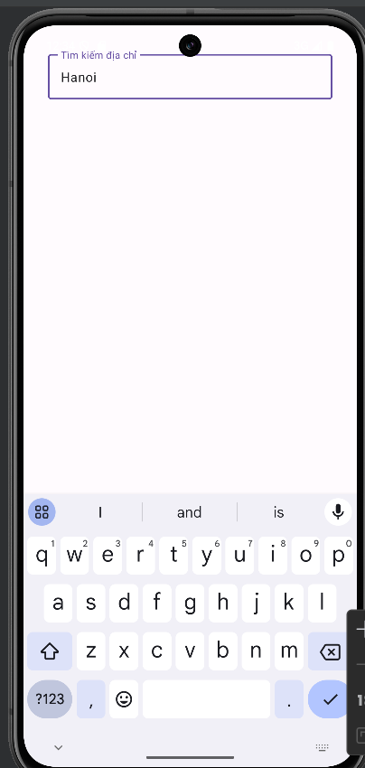
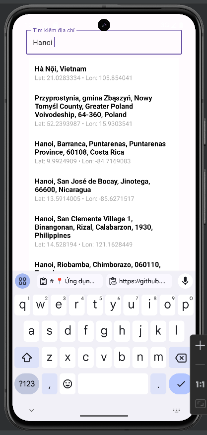
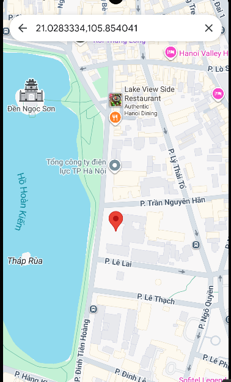

# 📍 Ứng dụng Tìm kiếm Địa chỉ

Ứng dụng mobile Android cho phép người dùng nhập địa chỉ, tìm kiếm thông tin qua API LocationIQ và mở vị trí trên Google Maps.

---

## 🚀 Cài đặt & Cấu hình

### 1. Clone project

```bash
git clone https://github.com/NhungHocIT/address-search-app.git
cd address-search-app
```

### 2. Cấu hình API Key

Mở file **`app/build.gradle`** và thêm dòng sau vào `defaultConfig`:

```gradle
defaultConfig {
    applicationId "com.example.address"
    ...
    buildConfigField "String", "LOCATIONIQ_KEY", "\"YOUR_API_KEY\""
}
```

👉 Thay `YOUR_API_KEY` bằng key lấy từ [LocationIQ](https://locationiq.com/).

### 3. Chạy ứng dụng

- Mở project bằng Android Studio
- Chọn thiết bị ảo (AVD) hoặc cắm điện thoại Android thật
- Nhấn ▶️ **Run app** để chạy

---

## 🖼️ Giao diện ứng dụng

 // màn hình tìm kiếm

// danh sách kết quả

// mở google map


---

## ⚙️ Công nghệ sử dụng

- Java + Android SDK
- Retrofit2 + Gson
- Material Design Components
- Google Maps Intent
- LocationIQ API

---

📂 Cấu trúc dự án address/

│── app/ # Source code chính (Android)

│── gradle/ # Cấu hình Gradle wrapper

│── README.md # Tài liệu giới thiệu dự án

## 👨‍💻 Tác giả

- **Tên:** Nhung
- 📧 Email: totuyetnhung14@gmail.com
- 📌 GitHub: [NhungHocIT](https://github.com/NhungHocIT)

---
